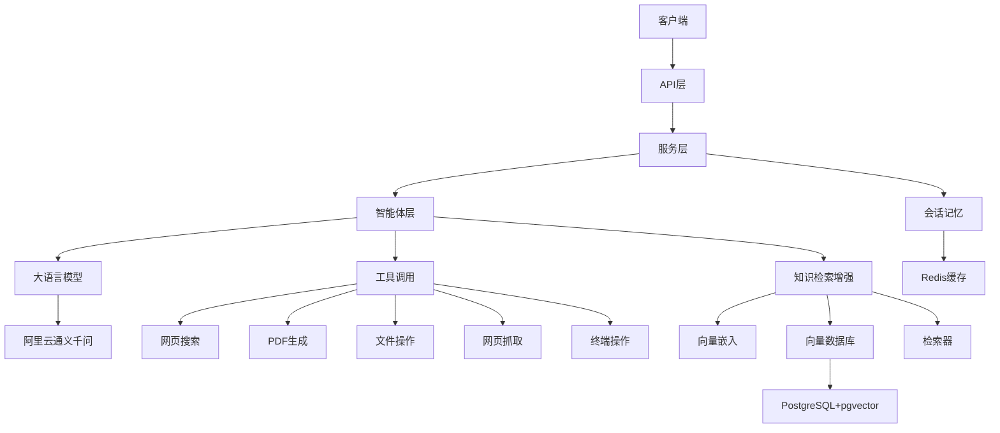

# LeiAI Agent - 智能旅游助手


**LeiAI Agent** 是一个基于 Spring Boot 3 和 Spring AI 构建的智能旅游助手系统，采用了 RAG (Retrieval-Augmented Generation)、Tool Calling 和 MCP (Multiple Conversation Paths) 等先进技术，为用户提供个性化的旅游规划、信息查询和智能对话服务。

## 📚 目录

- [项目概述](#项目概述)
- [系统架构](#系统架构)
- [核心功能模块](#核心功能模块)
- [技术选型](#技术选型)
- [项目结构](#项目结构)
- [快速开始](#快速开始)
- [API 文档](#api-文档)
- [项目亮点](#项目亮点)
- [最新优化](#最新优化)
- [未来规划](#未来规划)
- [许可证](#许可证)

## 🌟 项目概述

LeiAI Agent 是一个面向旅游领域的智能助手系统，通过整合大型语言模型（如阿里云通义千问）、知识检索增强、工具调用和多轮对话管理，为用户提供沉浸式的旅游规划和咨询体验。系统不仅能够回答旅游相关问题，还能主动调用各种工具（如网页搜索、PDF生成、文件操作等）来完成复杂任务，实现真正的智能代理功能。

### 项目背景

随着人工智能技术的发展，特别是大型语言模型（LLM）的出现，为构建智能对话系统提供了新的可能。然而，单纯依靠LLM存在知识时效性、工具使用能力和上下文管理等问题。本项目旨在解决这些痛点，构建一个能够自主思考、规划和行动的智能体系统，为旅游领域提供全方位的智能服务。

### 项目价值

- **提升用户体验**：通过自然语言交互，简化旅游规划流程
- **降低信息获取成本**：整合多源数据，提供一站式旅游信息服务
- **个性化推荐**：基于用户偏好，提供定制化旅游方案
- **自动化执行**：能够自主调用工具完成复杂任务，如生成旅游计划PDF、预订查询等

## 🏗️ 系统架构

LeiAI Agent 采用了模块化、分层的架构设计，确保系统的可扩展性和可维护性。



### 架构说明

1. **API层**：负责处理HTTP请求，提供RESTful API接口
2. **服务层**：实现业务逻辑，协调各组件工作
3. **智能体层**：核心AI代理层，实现思考-行动循环
4. **大语言模型**：提供自然语言理解和生成能力
5. **工具调用**：扩展智能体能力的各种工具
6. **知识检索增强**：通过向量数据库增强模型回答质量
7. **会话记忆**：管理多轮对话上下文

## 🧩 核心功能模块

### 1. 智能体系统 (Agent)

智能体是系统的核心，采用了ReAct（Reasoning and Acting）模式，通过"思考-行动"的循环来解决复杂问题。

- **BaseAgent**：抽象基础代理类，提供状态管理、执行流程控制
- **ReActAgent**：实现思考-行动循环的抽象类
- **ToolCallAgent**：能够调用外部工具的代理实现
- **LiManus**：集成了所有能力的超级智能体，可以自主规划和执行任务

智能体系统的核心优势在于其自主性和可扩展性，能够根据用户需求动态选择合适的工具和执行路径。

### 2. 工具调用系统 (Tools)

工具调用系统扩展了智能体的能力边界，使其能够与外部世界交互。
工具调用流程

框架控制的工具执行


- **WebSearchTool**：网络搜索工具，获取实时信息
- **PDFGenerationTool**：PDF生成工具，可创建旅游计划文档
- **FileOperationTool**：文件操作工具，管理本地文件
- **WebScrapingTool**：网页抓取工具，提取网页内容
- **TerminalOperationTool**：终端操作工具，执行系统命令
- **ResourceDownloadTool**：资源下载工具，获取远程资源
- **TerminateTool**：终止工具，结束当前任务执行

工具系统采用了统一的注册和调用机制，便于扩展新工具。

### 3. RAG知识增强系统 (RAG)

RAG系统通过检索相关知识来增强模型回答，特别适合处理专业领域问题。

- **向量存储**：使用PostgreSQL+pgvector存储文档向量
- **文档处理**：支持多种格式文档的处理和分块
- **检索器**：基于语义相似度检索相关文档片段
- **嵌入模型**：将文本转换为向量表示

### 4. 对话管理系统

- **会话状态管理**：跟踪和维护对话状态
- **上下文记忆**：使用Redis存储短期记忆
- **多轮对话支持**：维护连贯的对话体验

### 5. API接口系统

- **AgentController**：提供智能体交互接口
- **AppController**：提供应用核心功能接口
- **RagController**：提供知识检索相关接口

## 🔧 技术选型

### 后端技术

- **核心框架**：Spring Boot 3.5.0
- **AI框架**：Spring AI 1.0.0
- **大语言模型**：阿里云通义千问 (Qwen-Plus)
- **向量数据库**：PostgreSQL + pgvector
- **缓存系统**：Redis
- **ORM框架**：MyBatis-Plus 3.5.12
- **API文档**：Knife4j 4.5.0 (基于OpenAPI 3)
- **工具库**：Hutool 5.8.37、Lombok 1.18.38
- **PDF处理**：iText 9.1.0
- **网页抓取**：Jsoup 1.19.1
- **异常处理**：全局统一异常处理机制
- **响应封装**：统一API响应格式

### 前端技术

前端采用现代化的Web技术栈，提供直观的用户界面（注：本项目主要关注后端实现，前端为可选组件）。

- **框架**：Vue.js/React（可根据需求选择）
- **UI组件**：Element-Plus/Ant Design
- **HTTP客户端**：Axios
- **状态管理**：Pinia/Redux

## 📂 项目结构

项目采用了清晰的分层架构，各模块职责明确，便于维护和扩展：

```
src/main/java/com/lilei/leiaiagent/
├── agent/                  # 智能体核心实现
│   ├── BaseAgent.java      # 基础智能体抽象类
│   ├── ReActAgent.java     # ReAct模式智能体
│   ├── ToolCallAgent.java  # 工具调用智能体
│   ├── LiManus.java        # 综合智能体实现
│   └── model/              # 智能体模型
│       └── AgentState.java # 智能体状态
├── config/                 # 配置类
│   ├── SwaggerConfig.java  # Swagger文档配置
│   ├── WebMvcConfig.java   # Web MVC配置
│   └── ResponseAdvice.java # 统一响应处理
├── constant/               # 常量定义
│   ├── ApiConstants.java   # API相关常量
│   └── ErrorCode.java      # 错误码常量
├── controller/             # API控制器
│   ├── AgentController.java # 智能体控制器
│   └── ...
├── domain/                 # 领域模型
│   ├── entity/             # 实体类
│   │   ├── ChatSession.java # 会话实体
│   │   └── ChatMessage.java # 消息实体
│   └── dto/                # 数据传输对象
│       ├── ChatSessionDTO.java # 会话DTO
│       └── ChatMessageDTO.java # 消息DTO
├── exception/              # 异常处理
│   ├── GlobalExceptionHandler.java # 全局异常处理器
│   └── custom/             # 自定义异常
│       ├── BusinessException.java # 业务异常
│       ├── ResourceNotFoundException.java # 资源未找到异常
│       └── UnauthorizedException.java # 未授权异常
├── llm/                    # LLM集成
├── pojo/                   # 普通Java对象
│   └── vo/                 # 视图对象
│       ├── AgentRequestVO.java  # 智能体请求
│       ├── AgentResponseVO.java # 智能体响应
│       └── ApiResponse.java      # 统一API响应
├── prompt/                 # 提示词模板
├── rag/                    # RAG实现
├── service/                # 服务层
│   ├── api/                # 服务接口
│   │   └── AgentService.java # 智能体服务接口
│   └── impl/               # 服务实现
│       └── AgentServiceImpl.java # 智能体服务实现
├── tools/                  # 工具实现
├── utils/                  # 工具类
└── LeiAiAgentApplication.java # 应用入口
```

## 🚀 快速开始

### 环境要求

- JDK 21+
- Maven 3.8+
- PostgreSQL 14+（已安装pgvector扩展）
- Redis 6+

### 安装步骤

1. **克隆仓库**

```bash
git clone https://github.com/lilei/lei-ai-agent.git
cd lei-ai-agent
```

2. **配置环境变量**

创建 `.env` 文件并配置以下环境变量：

```properties
AI_DASHSCOPE_API_KEY=your_dashscope_api_key
SEARCH_API_KEY=your_search_api_key
```

3. **编译项目**

```bash
mvn clean package
```

4. **运行应用**

```bash
java -jar target/lei-ai-agent-0.0.1-SNAPSHOT.jar
```

5. **访问Swagger文档**

打开浏览器访问 `http://localhost:8082/api/swagger-ui.html`

### 配置说明

主要配置文件位于 `src/main/resources/application.yml` 和 `src/main/resources/application-dev.yml`，包含以下关键配置：

- 数据库连接信息
- Redis配置
- AI模型配置
- RAG系统参数
- 工具调用参数
- 日志配置

## 📖 API 文档

项目集成了Knife4j，提供了美观易用的API文档界面。主要API分为以下几类：

### 1. 智能体API

- `POST /api/agent/execute`：执行智能体任务（同步模式）
- `POST /api/agent/execute/advanced`：执行智能体任务（高级同步模式）
- `GET /api/agent/stream`：执行智能体任务（流式模式）
- `POST /api/agent/stream/advanced`：执行智能体任务（高级流式模式）
- `GET /api/agent/status`：获取智能体状态
- `POST /api/agent/reset`：重置智能体状态
- `POST /api/agent/stream/close/{sessionId}`：关闭流式连接

### 2. 应用API

- `GET /api/ai/chat`：聊天接口

### 3. RAG API

- `POST /api/rag/query`：知识库查询接口

## 💡 项目亮点

### 1. 智能体架构创新

我在设计智能体架构时，特别注重了可扩展性和灵活性。通过抽象基础代理类（BaseAgent）和实现ReAct模式（ReActAgent），构建了一个能够自主思考和行动的智能体系统。这种架构不仅适用于旅游领域，还可以轻松扩展到其他垂直领域。

智能体的状态管理机制（AgentState）确保了任务执行的可靠性，而基于步骤的执行循环使得复杂任务可以被分解为可管理的小步骤。这种设计使系统能够处理长链条的推理和行动序列，大大提升了智能体的能力边界。

### 2. 工具调用系统的灵活设计

工具调用系统采用了统一的注册和调用机制，使得添加新工具变得非常简单。每个工具都实现了标准接口，并通过ToolRegistration进行统一管理。这种设计使得智能体能够根据任务需求动态选择合适的工具，实现真正的工具增强型AI。

特别值得一提的是，我实现了工具调用的错误恢复机制，当工具调用失败时，系统会尝试重试或选择替代方案，提高了系统的鲁棒性。

### 3. 高性能的RAG实现

在RAG系统设计中，我采用了PostgreSQL+pgvector作为向量数据库，相比纯内存向量数据库，这种方案在大规模数据集上表现更加稳定，且支持持久化存储。

为了提高检索效率，我实现了基于HNSW（Hierarchical Navigable Small World）的索引机制，大大提升了向量检索的速度。同时，通过优化分块策略（chunk-size和chunk-overlap参数），平衡了检索精度和系统性能。

### 4. 流式响应机制

为了提升用户体验，我设计了基于SSE（Server-Sent Events）的流式响应机制，使得用户可以实时看到智能体的思考和行动过程，而不需要等待整个任务完成。这种设计特别适合长时间运行的复杂任务，提供了更好的交互体验。

流式响应机制还包含了完善的错误处理和资源清理逻辑，确保了系统的稳定性和资源利用效率。

## 🔄 最新优化

最近对项目进行了一系列优化和改进，主要包括：

### 1. 代码架构优化

- **接口与实现分离**：将服务层接口与实现分离，提高了代码的可测试性和可维护性
- **领域模型分层**：引入实体（Entity）和数据传输对象（DTO）分层，使数据流转更加清晰
- **常量抽取**：将API路径、错误码等常量抽取到专门的常量类中，避免硬编码

### 2. 异常处理机制

- **全局异常处理**：实现了统一的全局异常处理器，规范化异常响应格式
- **自定义异常体系**：设计了业务异常、资源未找到异常、未授权异常等自定义异常类
- **错误码标准化**：建立了统一的错误码体系，便于问题定位和排查

### 3. API响应标准化

- **统一响应格式**：所有API返回统一的响应格式，包含状态码、消息、数据等字段
- **响应拦截器**：实现了ResponseAdvice拦截器，自动包装控制器返回值
- **状态码规范**：定义了成功、错误、警告等不同状态的响应规范

### 4. 配置优化

- **Swagger文档增强**：完善了API文档配置，添加了更详细的描述和示例
- **跨域支持**：配置了全局CORS支持，便于前后端分离开发
- **日志配置**：优化了日志配置，支持文件日志和控制台日志，便于问题排查

### 5. 智能体服务改进

- **会话管理**：增强了会话管理功能，支持会话状态跟踪和历史记录
- **流式连接管理**：改进了SSE连接的生命周期管理，避免资源泄漏
- **参数验证**：添加了请求参数验证，提高系统健壮性

## 🔮 未来规划

1. **多模型支持**：集成更多大语言模型，如OpenAI GPT、Claude等
2. **多模态能力**：增加图像理解和生成能力
3. **知识库扩展**：丰富旅游领域知识库，提升专业问答质量
4. **工具生态扩展**：开发更多旅游相关工具，如酒店预订、机票查询等
5. **前端界面优化**：开发更友好的用户界面，提升用户体验
6. **性能优化**：进一步优化系统性能，支持更高并发
7. **多语言支持**：增加多语言支持，服务国际用户

## 📄 许可证

本项目采用 MIT 许可证 - 详情请参阅 [LICENSE](LICENSE) 文件 
